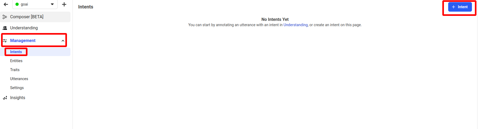

# Go-CRUD-API-example

### Preparation

1. Login to https://www.wolframalpha.com/ and developer portal 
2. Create AppID   and wait 24 hours
3. Save AppID  and use it in WOLFRAM_APP_ID
4. Login to https://wit.ai/
5. Create new app  
6. Create new intent for app  
7. Create new entity for app  
8. Save server access token  and use it in WIT_AI_TOKEN
9. Create an account in Slack
10. Go to https://api.slack.com/apps?new_app=1 and create slack app   
11. Get Slack application token and use it in SLACK_APP_TOKEN
12. Enable sockets   and save token 
13. Enable event subscriptions 
14. Configure Slack Event Subscriptions 
15. Configure Slack OAuth and Permissions with adding scopes   
16. Get Slack Bot User OAuth Token and set SLACK_BOT_TOKEN in config file 
17. Add ai-bot to the channel in Slack  

### Run

```
go run main.go
```

Go to Slack channel where ai-bot was added and ask question with next structure 
```
@wit-ai query for bot - {{TEST_OF_QUESTION}}
```
